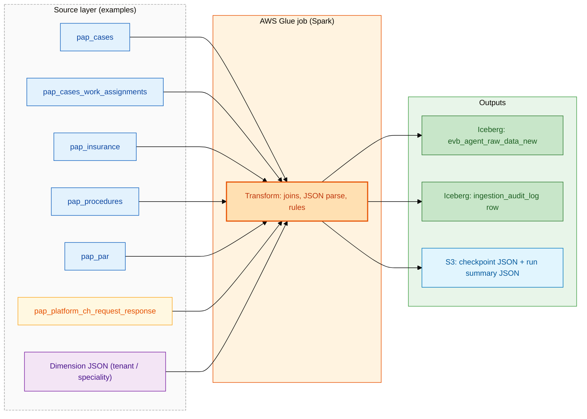
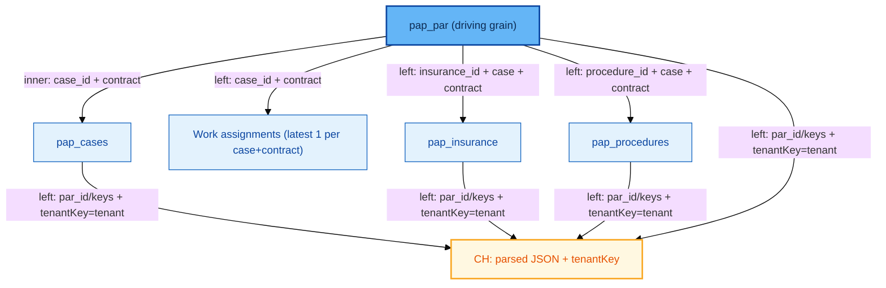

# EVB Agent Raw Data (New) — Business overview & technical reference

This document explains **what the job does in business terms**, **how data moves**, and **the main rules** implemented in `evb_agent_raw_data_new_glue_job.py`. It is written so both **business** and **technical** readers can follow it.

---

## 1. Business purpose (in plain language)

| Question | Answer |
|----------|--------|
| **What is this job for?** | It builds a **single, query-ready “wide” table** of **prior authorization (PA) / EVB** activity: case, insurance, procedure, work queue, and **clearinghouse (eligibility) details** in one place, per **line of business (contract)**, **tenant**, and **PAR (procedure authorization request)**. |
| **Who uses the output?** | Reporting, analytics, operations, and any process that needs **one row per PAR** (with case and benefits context) without hand-joining many source tables. |
| **Where does the data land?** | An **Iceberg** table in the data platform (e.g. `temp.evb_agent_raw_data_new` — exact name comes from the job **config JSON** in S3). |
| **How often / what window?** | The **date range** and other run settings are **not hardcoded in the script**; they are read from the **S3 config file** (e.g. a calendar window on **case created date**). |

---

## 2. High-level data movement

Data flows **from operational “bronze” tables** in the data lake → **transformed in AWS Glue (Spark)** → **written to a silver Iceberg table**, with **logging and audit** to S3 and an **ingestion audit** table.

**Colour key (used in the diagrams below)**

| Colour | Meaning |
|--------|--------|
| **Blue** | **Bronze** PAP tables in the data lake (cases, PAR, ins, pro, work assignments) |
| **Amber** | **Clearinghouse (CH)** — request/response JSON, tenantKey parsing |
| **Lilac** | **Reference** dimension (tenant / speciality JSON from S3) |
| **Orange** | **Glue** transform (joins, business rules, JSON parse) |
| **Green** | **Iceberg** target tables (silver + audit) |
| **Cyan** | **S3** artefacts (checkpoints, run JSON summaries) |

**Business takeaway:** The job is **not** a copy of one table; it **combines** several sources under **clear rules** so each output row is **one PAR in context of its case, contract, tenant, and (when it matches) clearinghouse data**.

---

## 3. Core business concepts (glossary)

| Term | Business meaning |
|------|-------------------|
| **Case** | A patient / access work item in the PA product (identified by `case_id` in the data). |
| **Contract** | A **line-of-business or customer contract** in the platform. The **same `case_id` can exist on different contracts**, so the job always uses **`case_id` + `contract`** together when joining. |
| **Tenant** | The **customer / org** (or environment key) on the case; it is matched to **clearinghouse** payloads using JSON **`tenantKey`**, and to a **reference file** for **speciality**. |
| **PAR** | **Procedure authorization** record — the **main grain** of the output: **one output row per PAR** (with insurance and procedure attached by IDs). |
| **Clearinghouse (CH)** | Eligibility / benefits request–response data (JSON in `request` and `response` columns). **Not** every PAR has a CH row. |
| **Speciality** | A **label** (e.g. Radiology) from a **managed mapping file**; if the tenant is not in that file, the job sets speciality to **“Others”**. |

---

## 4. What rules the job applies (business view)

1. **Time window (default driver: cases)**  
   - Unless in **test mode**, the job limits **cases** to **`created_on` in [start, end)** from the **config** (UTC semantics as configured).  
   - **Test mode** can restrict to a **list of case IDs** and may skip the time window on cases (see config).

2. **Contract on all PAP joins**  
   - Tables such as `pap_cases`, `pap_insurance`, `pap_procedures`, `pap_par`, and work assignments all use a column named **`contract`**.  
   - Joins use **`(case_id, contract)`** so data from one contract does not mix with another.

3. **One row per PAR (no “cartesian” explosion)**  
   - The pipeline is **PAR-first**: start from `pap_par`, join **case**, then **insurance** and **procedures** only by **foreign keys** + **case_id** + **contract** — not by “any row on the case” when a key is missing. This **reduces duplicate-looking rows** compared to joining all insurances × all procedures on a case.

4. **Work queue (latest per case + contract)**  
   - For work assignments, the job keeps a **single latest row per `(case_id, contract)`** (by timestamp / id), not every historical assignment.

5. **Clearinghouse matching**  
   - CH rows are **not** joined on a `contract` column in the CH table (that table does not have it).  
   - **Case id** and **ids** are parsed from JSON.  
   - **Tenant alignment:** `tenantKey` in the JSON (and paths like `tenantInformation.tenantKey` on requests) is normalized to match **`pap_cases.tenant`**, so the right CH payload attaches to the right case/tenant.

6. **Speciality**  
   - Loaded from a **JSON dimension** in S3 (same structure as the repo `Dimension/dim_tenant_speciality_master.json`).  
   - If there is no match, **speciality = “Others”** in the output.

7. **Writes and idempotence**  
   - The target table is **upserted** (merge) on **`case_id` + `par_id` + `contract`** (with null handling as implemented), using **`source_updated_at`** to pick the newer version when the job runs again.

8. **Observability**  
   - **Step row counts** in logs, **ingestion audit** row, **S3 JSON run summary**, and **checkpoint** (in S3) for operational tracking. Test / sample runs can **skip checkpoint advance** (config-driven).

---

## 5. Technical pipeline (step-by-step)

Simplified order matching the code:

1. **Load** job config from **S3**; validate; build Spark; assert required **bronze** tables have a **`contract`** column where required.  
2. **Load** tenant–speciality **dimension** from S3 (optional key).  
3. **Cases:** filter `pap_cases` by time or test case list; carry **`case_id` + `contract` + tenant and case attributes**.  
4. **Scope** other PAP tables to the same **(case_id, contract)** set.  
5. **Work queue:** `pap_cases_work_assignments` → latest per `(case_id, contract)`.  
6. **PAR / insurance / procedures:** `pap_par` **inner** to cases; **left** join insurance and procedures **by PAR foreign keys** + `case_id` + `contract`.  
7. **CH:** read `pap_platform_ch_request_response`, window to **latest per `request_id`**, **parse JSON**, **scope to case ids** in the load, then **left join** to the wide table using **PAR id and/or composite keys** and **tenant key match**.  
8. **Dim:** **left join** tenant speciality.  
9. **Project** silver columns; **merge** to Iceberg; **audit**; **checkpoint** (if not in test); **write** S3 summary in `finally`.

---

## 6. Join model (technical diagram)

**Colour key:** **Blue** = bronze PAP; **Darker blue** = driving grain (PAR); **Amber** = CH enrichment.

**Business note:** The **“spine”** of the table is **PAR + Case**. Insurance and procedure are **attributes** of that PAR; CH is an **enrichment** when a JSON message matches.

---

## 7. What is configurable without code change

Stored in the **S3 JSON config** (e.g. `evb_agent_raw_data_new_job_config.json` in the repo as a template):

- **Time range** (UTC) for the case load  
- **Target** Iceberg catalog, database, table, warehouse path  
- **S3 keys** for checkpoint, dimension file, **audit** log prefix  
- **Dev: test case IDs, row limits** (checkpoint behavior may be restricted in test)  
- **Audit label** (`data_source` value written to the shared audit table)

**Glue job parameters (runtime):** `JOB_NAME`, `S3_BUCKET`, `CONFIG_S3_KEY`.

---

## 8. For analysts (Athena / SQL)

- The **denormalized** result is the **Iceberg** table (e.g. `temp.evb_agent_raw_data_new`).  
- The job **does not** currently add **`modality`** to silver; that lives on **bronze** `pap_procedures` if you need it in ad hoc SQL or a future job change.
