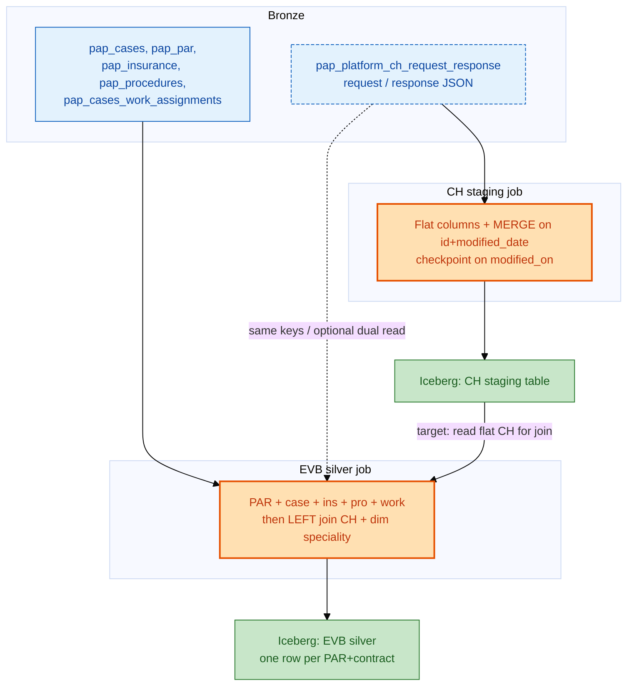
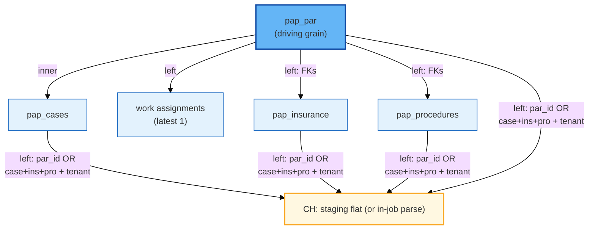

# EVB Agent Raw Data (New) — v2 — End-to-end product: CH staging + silver wide table

**Version 2** of the business and technical story for the **final analytics product**: a **silver Iceberg table** with **one row per PAR** (procedure authorization), **transactional** case / insurance / procedure / work context, and **clearinghouse (CH)** eligibility and benefit fields — built by first **normalizing CH JSON in a staging table**, then **joining that layer to the PAP transactional tables**.

**What v2 adds (vs v1):** a clear **three-layer** picture — **bronze** operational tables → **CH staging** (flat, merged extract) → **EVB silver** (PAR-first join of transactional + CH), plus a short **staging** section so readers see how the silver “CH columns” are produced.

---

## 1. The final product (what you get)

| Question | Answer |
|----------|--------|
| **What is the “product”?** | One **silver** Iceberg table: **one row per PAR** with **case**, **contract**, **tenant**, **insurance**, **procedure**, **work queue** (latest), optional **CH benefit/error columns**, and **tenant speciality** from a **dimension** file. |
| **What is the grain?** | **`case_id` + `par_id` + `contract`** (same as v1) — the spine is **PAR** on a **case** and **line of business**. |
| **Where does CH data come from, conceptually?** | **Clearinghouse** API traffic is first **flattened** in a **staging** Iceberg table (per CH message: ids, `modified_on`, `created_on`, plan/benefit/error fields, etc.). The **silver** job then **joins** that **CH side** to the **transactional** side built from `pap_par` + `pap_cases` + `pap_insurance` + `pap_procedures` + work queue. |
| **Why staging before silver?** | CH arrives as **nested JSON** with many envelopes (`response`, `ebResponseDto`, Waveland shapes). **Staging** applies **one consistent parse** and **upserts** (MERGE) so downstream jobs **read typed columns** instead of repeating fragile JSON in every consumer. |

---

## 2. Three layers (end-to-end flow)

| Layer | Content | Role |
|-------|---------|------|
| **Bronze** | PAP: `pap_cases`, `pap_par`, `pap_insurance`, `pap_procedures`, `pap_cases_work_assignments`; CH: **`pap_platform_ch_request_response`** (per API call: `request`, `response`, ids, `modified_on`, `tenant_code`, `vendor`…) | **Source of record** from the platform. |
| **CH staging (Iceberg)** | **`pap_platform_ch_request_response_staging`** (driven by a dedicated **Glue** job) | **Single flat CH fact**: parse/coalesce **plan**, **eligibility-style fields**, **deductible / OOP / co-pay / co-insurance**, **service** limits, **error** codes, `ch_payer_code` from request JSON, `procedure_id` / `insurance_id` / `par_id` for matching — **MERGE** on **`id` + `modified_date`**, **checkpoint** on `modified_on` upper bound = start of UTC day. |
| **Silver (EVB)** | **`evb_agent_raw_data_new`** (name from **config** in S3) | **Wide fact**: **transactional** joins first (PAR + case + ins + pro + work) → **left join CH** (match **PAR** + **tenant** or **composite** keys + **tenant**), then **left join** speciality. |

**Colour key**

| Colour | Meaning |
|--------|--------|
| **Blue** | **Bronze** PAP (transactional) |
| **Amber** | **CH** (bronze log + **staging** extract) |
| **Lilac** | **Reference** dimension (tenant speciality) |
| **Orange** | **Glue** (staging job vs **EVB** job) |
| **Green** | **Iceberg** (staging + silver + audit) |
| **Cyan** | **S3** (config, CH checkpoint, run summaries) |

**Dashed line:** today’s **EVB** implementation may still **read bronze CH** and **parse JSON** inside the same job; **target** architecture is to **read CH staging** for the join so there is a **single** CH extract. Either way, the **business join** to transactional tables is the same: **CH rows align to PAR (and case / ins / pro) + tenant**, not to `contract` on the CH table.

---

## 3. CH staging job (summary — the “pre-silver” CH product)

- **Input:** **Bronze** `pap_platform_ch_request_response` filtered on **`modified_on`**: not null, **&lt; start of current UTC day**, and **&gt; checkpoint** when present.  
- **Output:** one **row per bronze CH** `id`, with **flattened** benefit / plan / error fields, `tenant` = **`tenant_code`**, **`ch_payer_code`** from request JSON, **`insurance_id` / `procedure_id` / `par_id`** from many JSON path fallbacks, **`created_on`**, **`ingested_at`**, **`modified_date`**.  
- **Write model:** first run **create**; later runs **MERGE** on **`id` + `modified_date`**, **update** when **`modified_on` is newer** on the incoming row. **Checkpoint** is advanced to **max(`modified_on`)** in the successful batch.  
- **Not in staging:** the EVB **PAR-first** join — that happens only in the **EVB** job. Staging is **not** one row per PAR; it is **one row per CH message**.

---

## 4. EVB silver job — transactional spine, then CH

**Order of operations (logical):**

1. **Cases** in the **config** time window (or test case list).  
2. **Scope** `pap_par` (and related) to eligible **`(case_id, contract)`**.  
3. **Work queue:** at most one **latest** work row per case + contract.  
4. **Base wide frame:** from **`pap_par`**, **inner** to **case**; **left** to **insurance** and **procedures** using **PAR foreign keys** and **`(case_id, contract)`** — not a cartesian of all ins × pro on a case.  
5. **CH:** align **parsed CH** rows to this base:  
   - **Tenant match:** `tenant` on case, aligned to **CH tenant key** (normalized from JSON, same idea as v1).  
   - **Row match (either):** **`par.par_id` = CH `par_id`** and tenant, **or** **same `case_id` + insurance_id + procedure_id (with null-safe coalesce) +** tenant.  
6. **Speciality:** **left** join the **S3** tenant–speciality **dimension**; else **“Others”** as in v1.  
7. **Merge** the silver table on **`case_id` + `par_id` + `contract`**, using **`source_updated_at`** to pick the newer version on re-runs.  
8. **Audit** + **S3** summary; **checkpoint** (when not in test) as configured.

**Business takeaway (unchanged from v1):** the **spine** is still **PAR + case + contract**; **CH** is an **enrichment** when a message **matches**; the **v2** story is that **enrichment** can be read from a **dedicated CH staging** table for consistency and reuse.

---

## 5. Join model (transactional + CH) — same rule as v1

---

## 6. Glossary (carried from v1 + staging)

| Term | Meaning |
|------|--------|
| **Case** | Work item; **`case_id`** scoped with **`contract`**. |
| **Contract** | Line of business; never join PAP without **`case_id` + `contract`**. |
| **Tenant** | On **case**; used to **match** CH to the **same** workstream (JSON **tenant key** / normalized forms). |
| **PAR** | **Procedure authorization**; **one silver row per PAR+contract** (and keys as implemented). |
| **CH bronze** | Raw log of CH API: **request** / **response** JSON, platform columns. |
| **CH staging** | **Flattened, merged** CH extract keyed by **bronze `id`**, for reuse and **consistent** benefits columns. |
| **Speciality** | From **dimension** JSON; default **“Others”** if no map. |

---

## 7. What is configurable (high level)

- **EVB job:** S3 **config** — time window, target silver table, **checkpoint / audit / dimension** locations, test mode, `data_source` for audit. **Glue** parameters: `JOB_NAME`, `S3_BUCKET`, `CONFIG_S3_KEY`.  
- **CH staging job:** S3 **config** — bronze table name, target **staging** Iceberg table, **merge** id and `modified_on` columns, **partition** (e.g. `modified_date`), **checkpoint** key, **audit** label, optional `include_request_response_raw`.

---

## 8. v1 vs v2 (reader’s guide)

| Topic | v1 | v2 (this document) |
|--------|----|---------------------|
| **Focus** | EVB silver + inline CH parse from **bronze** | **Staged CH** + same **EVB** silver **join** story |
| **Diagrams** | Source → transform → single silver | **Bronze + staging** → **EVB** → silver |
| **CH staging job** | Not part of the narrative | **First-class**: flat table, MERGE, checkpoint |
| **Implementation detail** | CH read from `pap_platform_ch_request_response` in EVB | **Target**: silver reads **staging**; **today** some pipelines may still parse **bronze** in EVB — join rules stay the same |

---

*Mermaid diagrams render in common Markdown viewers. Colours follow the v1 style for continuity.*
